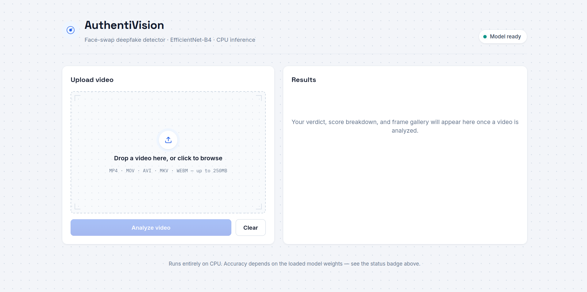
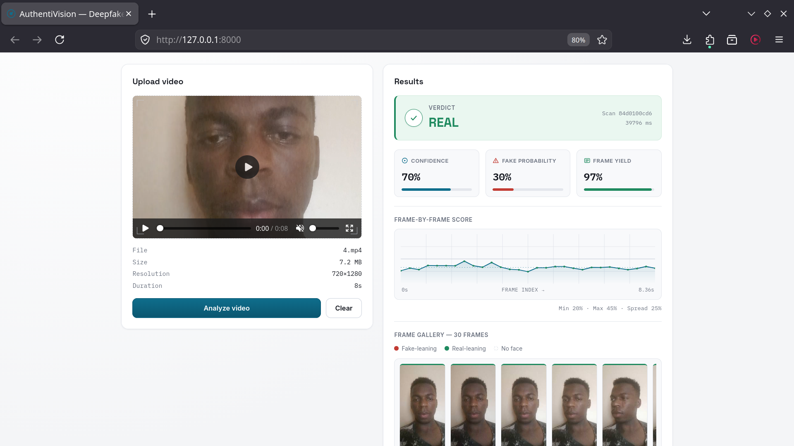
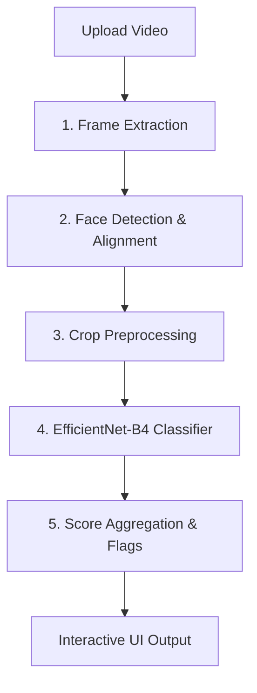

# AuthentiVision — Deepfake Video Detector

A high-performance, responsive web application for face-swap deepfake detection. It extracts frames from an uploaded video, detects and aligns faces using MTCNN, classifies them with a fine-tuned EfficientNet-B4 model, and aggregates scores to generate a real/fake verdict. The app is built on a clean FastAPI backend and a React (Vite) frontend with a professional, cool slate design system.

---

## Screenshots

### 1. Uploader Dashboard


### 2. Results and Diagnostics Output


---

## System Architecture & Pipeline

AuthentiVision processes video uploads through a structured 5-stage inference pipeline:



1. **Frame Extraction**: Samples 30 frames evenly across the video using OpenCV, extracting the frame index, frame data, and video frame rate (FPS).
2. **Face Detection & Alignment**: MTCNN detects bounding boxes and facial landmarks. If a face is found, it is cropped with a 10px padding margin to preserve facial boundary context.
3. **Preprocessing**: Converts the crop from RGB to BGR, resizes it to $380 \times 380$ (EfficientNet-B4's native resolution), and normalizes it to the $[-1, 1]$ interval via $(x / 127.5) - 1.0$.
4. **Classification**: Evaluates the preprocessed crops using a fine-tuned EfficientNet-B4 model.
5. **Score Aggregation & Flags**: Computes average probability, confidence metrics, and checks for warning conditions (high variance, low frame yield, boundary confidence) to raise diagnostic flags.

---

## Backend Details & Checkpoint Loading

Drop your fine-tuned weights checkpoint at `backend/models/weights/effnb4_best.pth`.

* **Model Architecture**: Configured in [backbone.py](file:///home/crazy/Documents/stuff/AuthentiVision/backend/pipeline/backbone.py) using the `efficientnet_pytorch` library.
* **State Dict Loading Key Fallbacks**: Checkpoints can be saved in different wrapping formats. [classifier.py](file:///home/crazy/Documents/stuff/AuthentiVision/backend/pipeline/classifier.py) tries loading weights using four key formats in order:
  1. Direct state dictionary matches.
  2. Stripping a leading `backbone.` prefix.
  3. Prepending an `efficientnet.` prefix.
  4. Prepending/stripping both combined.
* **Fail-Safe Startup**: If no checkpoint is found, the backend starts up using a randomly initialized backbone (reported as `using_finetuned_weights: false` in `/health`). If loading fails due to architecture mismatches, it is logged and reported via the `/health` endpoint, disabling prediction requests with a `503 Service Unavailable` error instead of silently serving invalid predictions.

---

## Project Structure

```text
AuthentiVision/
├── frontend/                  # React (Vite) Frontend Application
│   ├── src/
│   │   ├── components/        # UI components (ResultPanel, UploadPanel, ScopeTrace, VuMeter, FilmStrip, etc.)
│   │   ├── hooks/             # Custom React hooks (useDetection logic)
│   │   ├── App.jsx            # Main app shell & header
│   │   ├── api.js             # API wrapper (Axios endpoints)
│   │   ├── index.css          # Design tokens & styles (Cool Slate Theme)
│   │   └── main.jsx           # App entry point
│   ├── package.json
│   └── vite.config.js
├── backend/                   # FastAPI Backend Application
│   ├── pipeline/              # ML pipeline steps
│   │   ├── frame_extraction.py# Frame extraction utility
│   │   ├── face_detector.py   # MTCNN face detection/cropping
│   │   ├── preprocess.py      # Crop resizing & normalization
│   │   ├── backbone.py        # EfficientNet-B4 model definition
│   │   ├── classifier.py      # Weights loader & prediction
│   │   └── aggregate.py       # Metrics aggregation & quality flags
│   ├── utils/
│   │   └── validation.py      # Upload validation (size/type checks)
│   ├── models/weights/        # Model weights directory (effnb4_best.pth)
│   ├── main.py                # FastAPI main entry point & routing
│   └── requirements.txt       # Python backend dependencies
├── images/                    # Visual assets for documentation
│   ├── Dashboard.png          # App shell dashboard screenshot
│   └── Output.png             # Completed classification report screenshot
├── Dockerfile                 # Multi-stage production container configuration
├── setup.sh                   # Unix setup script (venv + npm build)
├── setup.bat                  # Windows setup script
├── PROJECT_JOURNEY.md         # Narrative development record
└── README.md                  # Project documentation
```

---

## Tech Stack

* **Frontend**: React (Vite), Vanilla CSS, responsive 2-column flex dashboard layout.
* **Backend**: FastAPI, PyTorch (CPU-optimized), OpenCV, MTCNN (`facenet-pytorch`).
* **Visuals**: SVG charts with interactive tooltips, grid overlays, and a professional light cool slate/ice-blue theme (`#f3f5f9`).

---

## Setup & Running Locally

### Prerequisites
* Python 3.11 – 3.13
* Node.js 18+

### 1. Installation & Environment Setup

#### Linux / macOS
Run the one-time shell setup script to create the virtual environment, install PyTorch (CPU-only version to avoid CUDA bulk) and other backend requirements, and build the React frontend:
```bash
./setup.sh
```

#### Windows
Run the batch setup script (or double-click `setup.bat` in File Explorer) to configure your Python environment and build the frontend assets:
```cmd
setup.bat
```

### 2. Running the Server

#### Linux / macOS
Activate the virtual environment, navigate to the `backend/` directory, and run the FastAPI server via Uvicorn:
```bash
source venv/bin/activate
cd backend
uvicorn main:app --reload
```

#### Windows
Activate the virtual environment, navigate to the `backend/` directory, and run the Uvicorn server:
```cmd
venv\Scripts\activate.bat
cd backend
uvicorn main:app --reload
```

After running the server, visit `http://localhost:8000` to launch the application interface.

*Note: For frontend development with Hot Module Replacement (HMR), run `npm run dev` in the `frontend/` folder in a separate terminal. It will proxy API requests to port `8000` automatically.*

---

## API Endpoints

### 1. Detect Video (`POST /detect`)
Uploads a video file for deepfake classification.
* **Parameters**: `video` (multipart/form-data)
* **Response**:
```json
{
  "label": "fake",
  "confidence": 0.53,
  "average_fake_probability": 0.53,
  "frames_analyzed": 30,
  "frames_extracted": 30,
  "score_distribution": {
    "minimum": 0.3445,
    "maximum": 0.7194,
    "average": 0.5312,
    "spread": 0.375
  },
  "quality_flags": [
    "The overall score is close to the real/fake decision boundary — treat this result cautiously."
  ],
  "scan_id": "e87542635",
  "processing_ms": 29838,
  "using_finetuned_weights": true,
  "resolution": "288x512",
  "frames": [
    {
      "index": 0,
      "timestamp": 0.0,
      "thumbnail": "data:image/jpeg;base64,...",
      "face_detected": true,
      "fake_probability": 0.3445
    }
  ]
}
```

### 2. Health & Model Checks (`GET /health`)
Returns backend system statuses, checkpoint state, and model details.
* **Response**:
```json
{
  "status": "ok",
  "using_finetuned_weights": true,
  "load_error": null,
  "architecture": "EfficientNet-B4",
  "input_resolution": 380,
  "sampled_frames_target": 30
}
```
