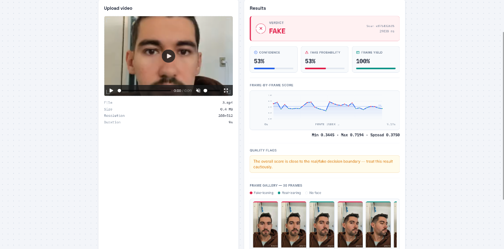

# Deepfake Video Detector

Samples frames from an uploaded video, detects and crops any face in each frame, classifies each with an EfficientNet-B4 model, and returns a real/fake verdict with a confidence score, a per-frame gallery, and data-driven quality flags. CPU only, single process — FastAPI serves both the built React UI and the `/detect` API from one port.

## Screenshots

### 1. Uploader Dashboard


### 2. Results and Analysis


## Using your own checkpoint

Drop your EfficientNet-B4 checkpoint at `backend/models/weights/deepfake_classifier.pt` (or `.pth` — either extension is picked up automatically).

`backend/pipeline/backbone.py` builds the architecture via the `efficientnet_pytorch` package (not timm), mirroring the `.features()` / `.classifier()` split from a typical detector wrapper class, so `.features()` returns the pooled 1792-dim feature vector and `.classifier()` applies the final 2-class layer.

**Key-naming fallback:** since checkpoints can be saved a few different ways depending on how the model was wrapped during training, `classifier.py` tries these in order until one matches:
1. As-is
2. With a leading `backbone.` prefix stripped (common when saved from a full detector class that wraps `self.backbone = ...`)
3. With an `efficientnet.` prefix added (common when saved directly from a bare `EfficientNet` instance)
4. Both of the above combined

If none match, `load_state_dict` fails with a key-mismatch error. That's handled without crashing the app: it's logged clearly, exposed via `GET /health` as `load_error`, and `/detect` returns a `503` with the same message rather than silently returning meaningless predictions. If this happens, the checkpoint most likely uses a different architecture than plain `efficientnet-b4` (a different EfficientNet variant, or extra custom layers) — adjust `backbone.py` to match.

If no checkpoint is found at all, the app still starts (useful for testing the pipeline) on a randomly-initialized backbone — `GET /health` reports `"using_finetuned_weights": false`.

## Requirements

- Python 3.11–3.13 (see the note in `backend/requirements.txt` about Python 3.14 wheel availability for some ML dependencies)
- Node.js 18+ (only needed to build the frontend, not at runtime)

## Setup

```bash
./setup.sh
```

Creates a venv, installs backend dependencies, installs `facenet-pytorch` separately (see "Dependency notes"), and builds the React frontend. Then run:

```bash
source venv/bin/activate
cd backend
uvicorn main:app --reload
```

Visit `http://localhost:8000`.

To iterate on the frontend with hot reload instead of rebuilding each time, run `npm run dev` inside `frontend/` in a separate terminal (proxies API calls to the backend on :8000 — see `frontend/vite.config.js`) while `uvicorn` runs in the other.

## Project structure

```
deepfake-detector/
├── frontend/                    React app (Vite)
│   └── src/
│       ├── App.jsx              upload, health check, result panel, frame gallery
│       ├── api.js               POST /detect
│       └── index.css
├── backend/
│   ├── main.py                    FastAPI app: serves the frontend, builds the frame gallery
│   ├── pipeline/
│   │   ├── frame_extraction.py    samples ~30 evenly-spaced frames (+ index, fps)
│   │   ├── face_detector.py       MTCNN face detect + crop, CPU only, 1:1 frame-aligned
│   │   ├── preprocess.py          resize/normalize crops to 380x380 for EfficientNet-B4
│   │   ├── backbone.py            EfficientNet-B4 architecture (efficientnet_pytorch, no timm)
│   │   ├── classifier.py          loads the checkpoint, tries a few key-naming conventions
│   │   └── aggregate.py           combines per-frame scores + computes quality flags
│   ├── utils/validation.py      file type/size checks (250 MB limit)
│   ├── models/weights/          put your checkpoint here (.pt or .pth)
│   └── requirements.txt
├── setup.sh
└── .gitignore
```

## UI

- Health badge in the header — checks `GET /health` on load, shows whether the model is ready, degraded (checkpoint mismatch), or the backend is offline
- Drag-and-drop video upload with live preview and progress bar
- Verdict, confidence, average fake probability, frames used, processing time, and a scan ID
- Score distribution bar (min / max / average / spread across analyzed frames)
- Quality flags — plain-language warnings computed from the actual data (low face-detection coverage, high score variance, a result close to the decision boundary), not decorative
- Frame gallery — every sampled frame as a thumbnail, bordered green/red/neutral by classification, labeled with timestamp and score
- Collapsible technical details panel with model metadata and the raw JSON response

## Dependency notes

- **CPU-only.** Plain `pip install torch` on Linux pulls the CUDA build, dragging in ~10 extra `nvidia-*`/`triton` packages even without a GPU. `backend/requirements.txt` forces the CPU wheel via `--extra-index-url https://download.pytorch.org/whl/cpu` as its first line — keep that line first if you edit the file. Device selection code (`cuda` vs `cpu` branching) has been removed entirely rather than just defaulted, since it isn't needed.
- **No timm.** The classifier is built directly on the `efficientnet_pytorch` package instead — see `backbone.py`.
- **facenet-pytorch is installed with `--no-deps`** (see `setup.sh`). Its own `setup.py` hard-pins ancient ranges (`torch<2.3.0`, `numpy<2.0.0`, `Pillow<10.3.0`) that conflict with the modern versions this project needs and with Python 3.14 itself. `--no-deps` skips those checks; its real runtime needs (`requests`, `tqdm`) are listed directly in `requirements.txt`.
- **Pillow must be `>=12.0.0`** — the first release with prebuilt wheels for Python 3.14. Older versions only ship a source distribution for 3.14, and building that from source fails outright on an old setuptools/pyproject.toml bug.
- **opencv-python-headless is pinned to `4.13.0.92`**, not the newest release. Version `4.13.0.90` shipped with a bug that broke imports on headless Linux (missing `libxcb.so.1`); `4.13.0.92` is the official fix. Staying on 4.x also avoids OpenCV 5.0's breaking API changes.
- **No Docker.** This project runs as a plain Python process (`uvicorn`) — no containerization.

## API

`POST /detect` — multipart form field `video`. Returns:

```json
{
  "label": "fake",
  "confidence": 0.87,
  "average_fake_probability": 0.87,
  "frames_analyzed": 28,
  "frames_extracted": 30,
  "score_distribution": { "minimum": 0.41, "maximum": 0.98, "average": 0.87, "spread": 0.57 },
  "quality_flags": ["..."],
  "scan_id": "a1b2c3d4e5",
  "processing_ms": 4231,
  "using_finetuned_weights": true,
  "frames": [
    { "index": 0, "timestamp": 0.0, "thumbnail": "data:image/jpeg;base64,...", "face_detected": true, "fake_probability": 0.91 }
  ]
}
```

`GET /health`:

```json
{
  "status": "ok",
  "using_finetuned_weights": true,
  "load_error": null,
  "architecture": "EfficientNet-B4",
  "input_resolution": 380,
  "sampled_frames_target": 30
}
```
